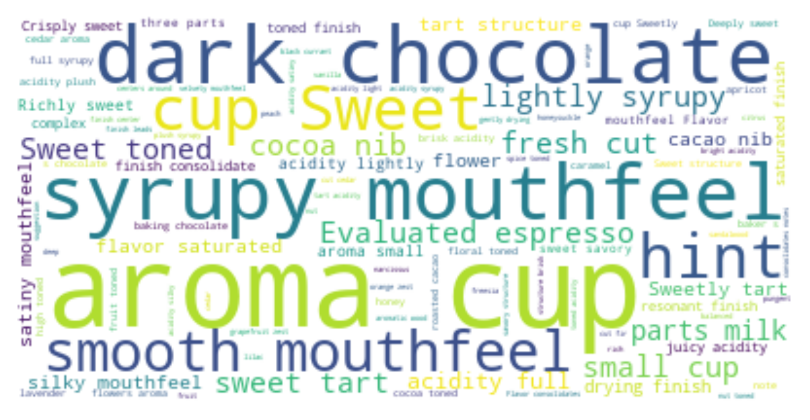
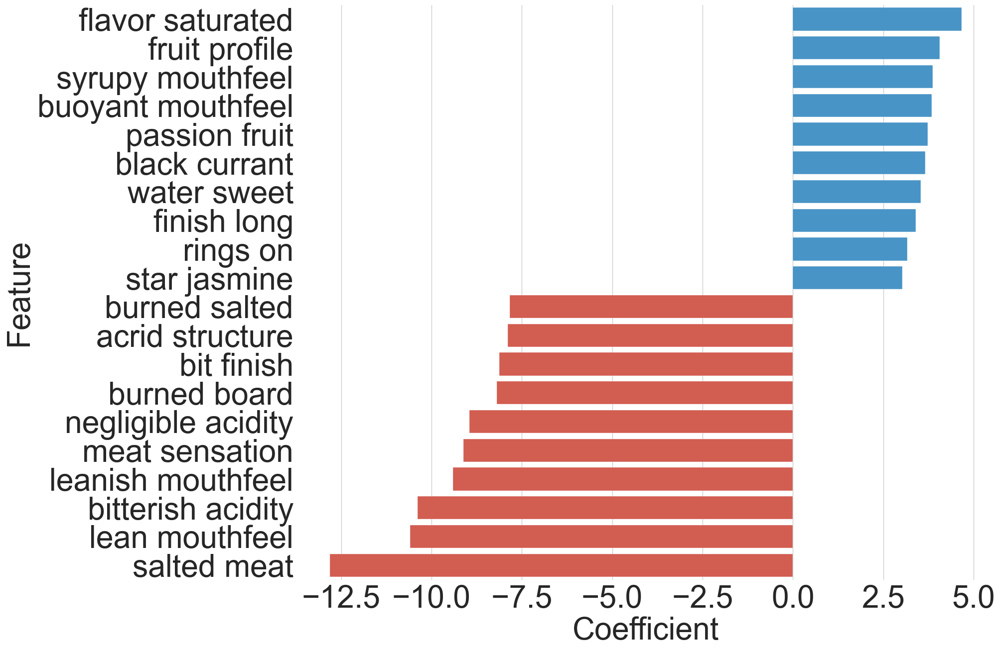

# Syrupy Mouthfeel and Hints of Chocolate Predicting
## Coffee Review Scores using Text Based Sentiment




## Setup 

Install dependencies 
````shell
pip install -r requirements.txt
````

## Usage

All the scripts are included in the `scripts` folder.

to run the scripts, use the following command

````shell
python scripts/<script_name>.py
````

## Data

The data is stored in the `data` folder. The data is a csv file. The raw data is a txt file. The data is scraped from [Coffee Review](https://www.coffeereview.com/).


## Results

The results of the hyperparameter tuning are stored in the `plots` folder. The overall ranking is saved in `results/results.csv.




## License

[MIT](https://choosealicense.com/licenses/mit/)